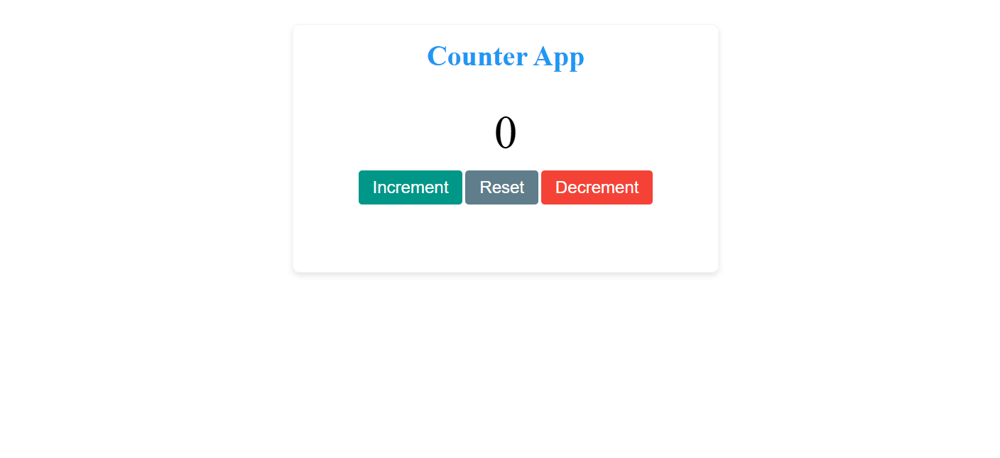

# Counter App

A simple **Counter Application** built using **HTML, CSS, and JavaScript**.  
This project helped me understand **DOM manipulation, event handling, and basic JavaScript logic**.

---

## 🔹 Features

- Increment the counter value  
- Decrement the counter value  
- Reset the counter to zero  
- Clean and responsive UI  

---

## 🔹 Technologies Used

- HTML5  
- CSS3  
- JavaScript (DOM Manipulation)

---

## 🔹 How It Works

- The counter value is stored in a JavaScript variable
- Button clicks are handled using event listeners
- The UI updates dynamically based on the counter value.
